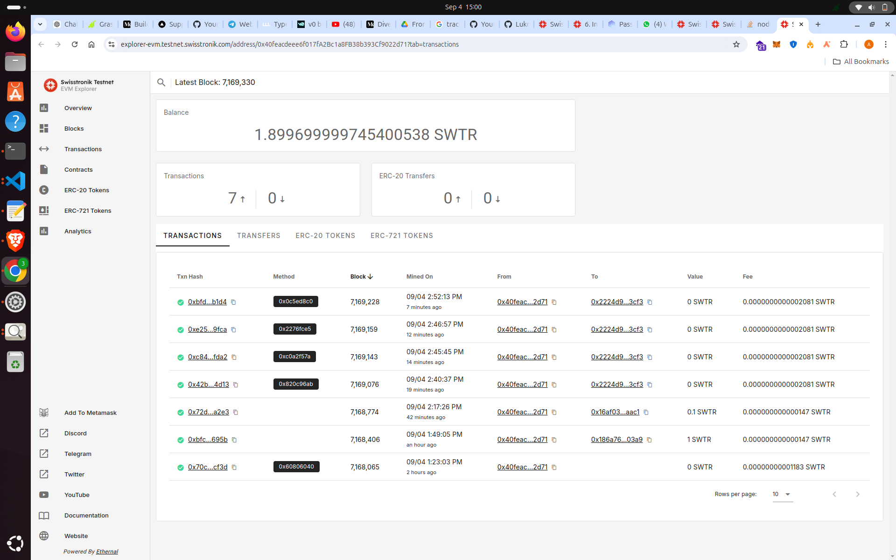

# Supply Chain Management Smart Contract

## 1. **Introduction**
The Supply Chain Management Smart Contract is a decentralized application built on the Ethereum blockchain, designed to streamline and improve transparency in tracking product movements, statuses, and conditions across the supply chain. The contract allows manufacturers, transporters, and consumers to monitor the status and health of products at every stage of the supply chain.

## 2. **Problem Statement: Challenges in Tracking Supply Chain**
Tracking products through the supply chain presents several challenges:
- **Lack of transparency**: Traditional supply chain systems often suffer from a lack of visibility, making it difficult to verify product authenticity and track its journey from manufacturer to consumer.
- **Data tampering**: Centralized systems are vulnerable to fraud, where product information can be tampered with, leading to incorrect or misleading data.
- **Accountability**: Determining responsibility in the event of product damage or delays is challenging, as it's hard to pinpoint where issues occur.
- **Real-time updates**: Keeping all parties updated on the current status of the product, especially in international trade, is difficult.

## 3. **How the Smart Contract Solves the Problems**
The **Supply Chain Smart Contract** addresses these problems with a decentralized and transparent approach. Here’s a breakdown of the logic and functionality used in the contract to solve these issues:

- **Immutable Tracking**: The contract uses blockchain’s immutability to ensure that once a product is created, its details (manufacturer, transporter, consumer, health condition, etc.) are securely stored and cannot be altered or tampered with.
  
- **Role-based Authorization**: Only authorized participants (manufacturer, transporter, and consumer) can update product information, such as status and health conditions, ensuring accountability at each stage.
  
- **Event Emissions**: Each change in product status or health condition triggers an event (`ProductStatusUpdated`, `HealthConditionUpdated`), which can be listened to by external systems for real-time notifications.

- **Health Condition Monitoring**: The contract tracks and updates the health condition of products, ensuring the receiver can verify the condition on delivery.

- **Transparent Product Lifecycle**: The contract provides complete visibility from the moment a product is created until it reaches the consumer. The product’s status (`Ordered`, `InTransit`, `Delivered`) and health condition (`New`, `Good`, `Damaged`) can be queried at any time.

---

## 4. **Smart Contract Setup, Config, Deployment, and Interaction**

### Prerequisites
1. **Hardhat**: Ensure that you have Hardhat installed.
2. **Node.js**: You’ll need Node.js and npm installed.
3. **MetaMask**: A wallet for deploying the contract on a testnet/mainnet.
4. **Private Key**: You need your private key stored in an `.env` file for deployment.
5. **Swisstronik utilities**: You’ll use `@swisstronik/utils` for encryption and interaction with the Swisstronik network.

### Setting Up the Contract

1. **Clone the repository**:
   ```bash
   git clone https://github.com/Lukman-01/ByteX-Project.git
   cd Smart-Contract
   ```

2. **Install dependencies**:
   ```bash
   npm install
   ```

3. **Create `.env` file**:
   Set up your `.env` file with the following content:
   ```
   PRIVATE_KEY=your_private_key_here
   ```

4. **Configure Hardhat**:
   The Hardhat configuration is already set up in `hardhat.config.js`. It includes:
   - **Swisstronik testnet URL**: `https://json-rpc.testnet.swisstronik.com/`
   - Your private key for account management.

### Hardhat Config:
```typescript
import "@nomicfoundation/hardhat-toolbox";
import * as dotenv from "dotenv";
dotenv.config();

const { PRIVATE_KEY } = process.env;

module.exports = {
  solidity: "0.8.26",
  networks: {
    swisstronik: {
      url: "https://json-rpc.testnet.swisstronik.com/", 
      accounts: [`0x${PRIVATE_KEY}`],
    },
  },
};
```

### Deploy the Smart Contract

1. **Compile the Contract**:
   Run the following command to compile the Solidity contract:
   ```bash
   npx hardhat compile
   ```

2. **Deploy the Contract**:
    
   Run the deployment script:
   ```bash
    npx hardhat ignition deploy ./ignition/modules/deploy.ts --network swisstronik
   ```

   Example output:
   ```
   Contract deployed to: 0x6E76a6C99cBDBf9d32D248907842707D52309f3e
   ```
3. **Contract Verification**:
   ```
   npx hardhat verify 0xFc1169dEaF7D43DC80fB924DCCdCf8A184791c6a --contract contracts/SupplyChain.sol:SupplyChain
   ```

   The output will looks like this:

   Successfully submitted source code for contract
   contracts/SupplyChain.sol:SupplyChain at 0xFc1169dEaF7D43DC80fB924DCCdCf8A184791c6a
   for verification on the block explorer. Waiting for verification result...

   Successfully verified contract SupplyChain on the block explorer.
   https://explorer-evm.testnet.swisstronik.com/address/0xFc1169dEaF7D43DC80fB924DCCdCf8A184791c6a#code

### Interaction with the Contract

After deploying the contract, you can interact with it on the Swisstronik testnet.

```
npx hardhat run scripts/updateCreationFee.ts --network swisstronik
```
```
npx hardhat run scripts/getCreationFee.ts --network swisstronik
```

#### Transaction Hash for Updating Creation Fee:
- **Transaction Hash**: `0xea3683f8c1a9fc33c814d54c9c74f73ae0fd6689053f07f8a6f57800f3f9d473`
- **Image of transaction confirmation**:



## CHECK IMAGES FOLDER FOR OTHER oNCHAIN iNTERACTIONS

## 5. **Efficiency of the Contract**

### Gas Optimization

The contract is designed with gas optimization in mind by:
- **Enums**: Using enums for status (`Status`) and health condition (`HealthCondition`) reduces storage costs since enums are packed into fewer bytes compared to strings.
- **Structs**: Grouping related information about a product into a `struct` ensures efficient storage, as accessing and updating data in a struct reduces the need to interact with multiple state variables.
- **Custom Errors**: The contract uses custom errors (e.g., `NotAuthorized`, `IncorrectFee`, etc.) instead of revert messages, saving gas by reducing the amount of data stored in error messages.

### Security Considerations

The contract includes several security measures:
- **Role-based Access Control**: Only the manufacturer, transporter, and consumer can update product details. This is enforced by the `_onlyAuthorized` function, ensuring that unauthorized accounts cannot modify the contract state.
- **Custom Error Handling**: The contract uses specific custom errors for common issues such as incorrect access and invalid transitions, ensuring that error handling is gas efficient and the contract doesn't perform unnecessary actions.
- **Immutable Product ID**: Once a product is created, its ID, manufacturer, transporter, and consumer details cannot be modified, ensuring the integrity of the product's history.
- **Private Functions for Critical Checks**: Functions that handle permissions or restrict access (like `_onlyOwner` and `_onlyAuthorized`) are declared private, ensuring they cannot be accessed externally.

These optimizations and security measures ensure the contract is efficient in terms of both gas usage and security, reducing costs and vulnerabilities.


### Frontend

## Introduction

This application is a blockchain-based supply chain tracking system that provides real-time visibility into the movement and status of products. It leverages Web3.js and the Swisstronik plugin to interact with the Ethereum-based blockchain network and smart contracts. Users can register new products on the blockchain, track their status, and update their information as they move through the supply chain. The app consists of three main pages: **Home**, **Dashboard**, and **Tracking**.

---

## Pages Overview

### 1. **Home Page**

- **Purpose**: The Home Page is the landing page of the application, offering users an introduction to the platform. It highlights the benefits of using blockchain for supply chain tracking, such as transparency, immutability, and real-time updates.
  
- **Features**:
  - A simple and clean introduction to the application.
  - Call-to-action buttons for signing up or logging in to start tracking products.

---

### 2. **Tracking Page**

- **Purpose**: The Tracking Page is where users can add new products to the blockchain and monitor the status of their existing products.
  
- **Features**:
  - **Add New Product**: A form that allows users to register new products on the blockchain. Information such as product name, serial number, transporter, consumer, and health condition is required.
  - **Product List**: Displays all registered products. Each product entry shows the name, serial number, transporter, current status, and action options (e.g., update status).
  - **Real-Time Updates**: After adding or modifying a product, users can immediately see the changes reflected on the page.
  - **Blockchain Integration**: The tracking page interacts directly with a smart contract deployed on the Ethereum blockchain via Web3.js and the Swisstronik plugin. All actions are recorded immutably on the blockchain.

---

## How It Works

### Blockchain and Smart Contract Interaction
- The app uses **Web3.js** and the **Swisstronik plugin** to communicate with an Ethereum-compatible blockchain network.
- **Smart Contract**: The core functionality of the supply chain tracking system is implemented in a Solidity smart contract. This contract manages products and their statuses.
- **Contract Methods**:
  - `addProduct`: Registers a new product on the blockchain.
  - `getAllProducts`: Retrieves all products registered by the user.
  - `updateStatus`: Updates the status of a product (e.g., from "pending" to "intransit").

---

## Setup and Installation

To set up the application locally:

1. **Clone the repository**:
   ```bash
   git https://github.com/Lukman-01/ByteX-Project.git
   cd Frontend
   ```

2. **Install dependencies**:
   ```bash
   npm install
   ```

3. **Configure environment**:
   - Ensure you have a `.env` file in the root directory with the following:
     - `RPC_URL`: The Swisstronik testnet or mainnet RPC URL.
     - `PRIVATE_KEY`: Your private key for signing transactions on the blockchain.

4. **Run the application**:
   ```bash
   npm run dev
   ```

---

## Technologies Used

- **Frontend**:
  - React.js
  - Tailwind CSS
  - Web3.js
  - Swisstronik Plugin
  - RainbowKit (for wallet management)

- **Backend (Smart Contract)**:
  - Solidity
  - Hardhat

---

## Future Improvements

- Add notification features for real-time tracking updates.
- Enhance security features with multi-signature contracts for high-value products.
